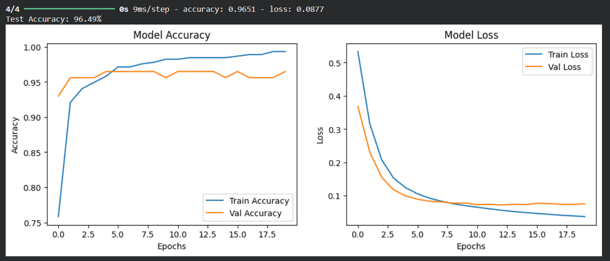

#  Breast Cancer Prediction using Neural Networks

##  Project Overview
This project implements a **binary classification system** to predict whether a breast tumor is **malignant** or **benign** using clinical features.  
A **neural network model** is trained on the Wisconsin Diagnostic Breast Cancer dataset with a strong emphasis on **robust evaluation** and **medical-safe performance metrics**.

The project demonstrates an **end-to-end machine learning workflow**, including data preprocessing, model training, evaluation, and visualization.

---

##  Problem Statement
Early and accurate detection of breast cancer plays a critical role in improving patient survival rates.  
The objective of this project is to build a machine learning model that assists in classifying breast tumors using numerical features extracted from digitized images of breast masses.

---

##  Dataset Information
- **Dataset:** Wisconsin Diagnostic Breast Cancer Dataset  
- **Source:** Scikit-learn  
- **Total Samples:** 569  
- **Number of Features:** 30 numerical features  
- **Target Classes:**
  - `0` → Benign  
  - `1` → Malignant  

This dataset is widely used in healthcare machine learning research and serves as a reliable benchmark for binary classification problems.

---

##  Data Preprocessing
The following preprocessing steps were applied:

- Stratified train-test split to preserve class distribution
- Feature standardization using `StandardScaler`
- Strict separation of training and testing data to avoid data leakage

---

##  Model Architecture
A fully connected neural network was implemented using TensorFlow/Keras with the following configuration:

- **Input Layer:** 30 features  
- **Hidden Layers:**
  - Dense layer with 64 neurons (ReLU activation)
  - Dense layer with 32 neurons (ReLU activation)
- **Output Layer:**
  - Dense layer with 1 neuron (Sigmoid activation)

**Training Configuration:**
- Loss Function: Binary Cross-Entropy  
- Optimizer: Adam  
- Batch Size: 32  
- Epochs: 20  

This architecture balances performance and generalization while minimizing overfitting.

---

##  Training & Validation Performance
The plot below shows **training and validation accuracy and loss** across epochs.  
The curves indicate stable convergence and strong generalization on unseen data.



---

##  Model Evaluation
The model was evaluated using metrics appropriate for medical classification tasks:

- Accuracy  
- Precision  
- Recall  
- F1-score  
- Confusion Matrix  

> **Recall is emphasized**, as false negatives in cancer detection can have serious real-world consequences.

The model achieves approximately **96% accuracy** on the test dataset with strong recall for malignant cases.

---

##  Sample Predictions

The model outputs probability scores along with predicted labels for interpretability:

```Sample 1: Probability = 0.93 | Predicted = Malignant | Actual = Malignant```
```Sample 2: Probability = 0.00 | Predicted = Benign | Actual = Benign```


---

##  Technology Stack
- Python  
- NumPy  
- Matplotlib  
- Scikit-learn  
- TensorFlow / Keras  
- Jupyter Notebook  

---

breast-cancer-prediction/
│
├── assets/
│   └── training_metrics.png
│
├── breast_cancer_prediction.ipynb
├── README.md
├── requirements.txt
└── LICENSE

